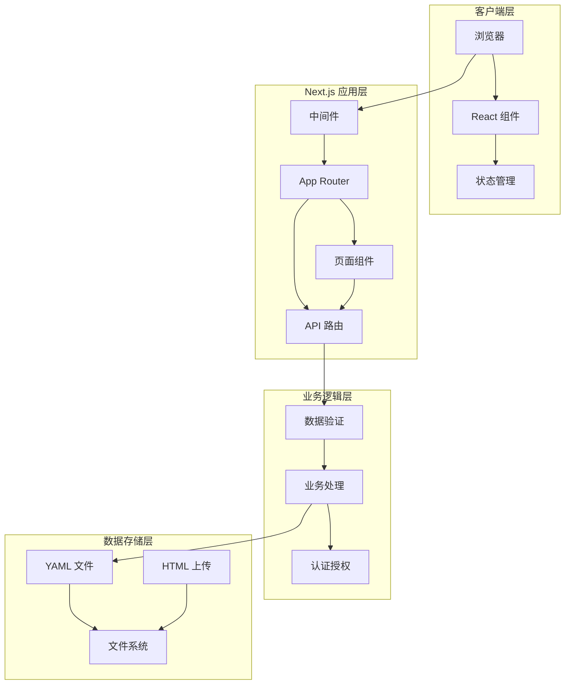
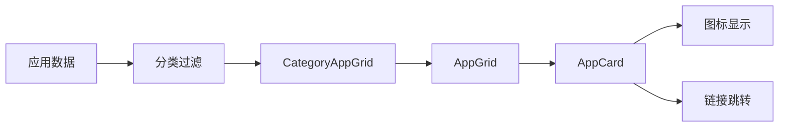
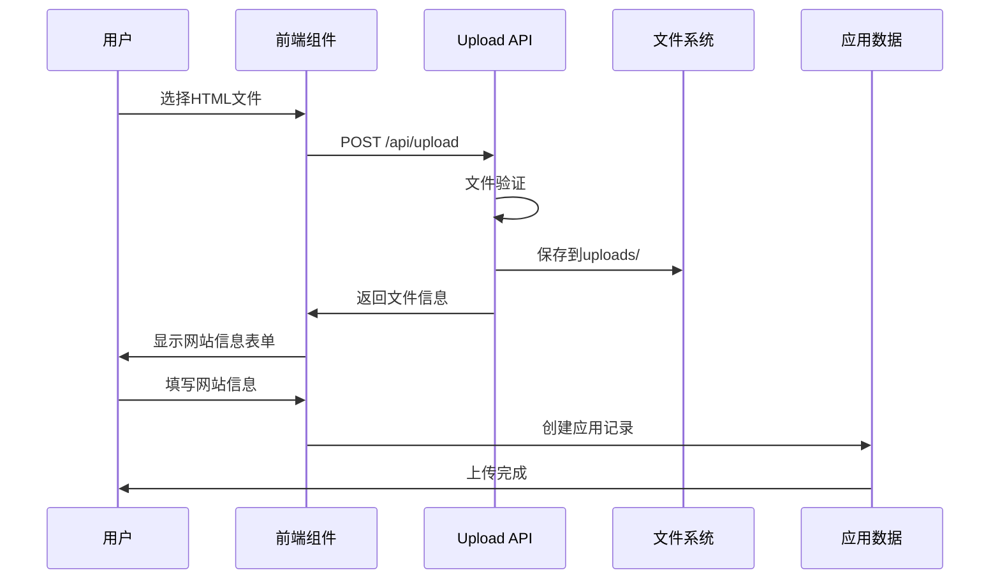
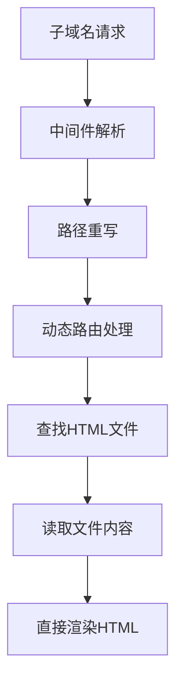
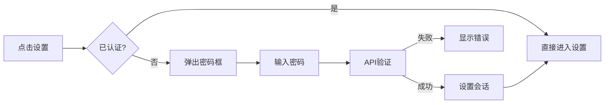
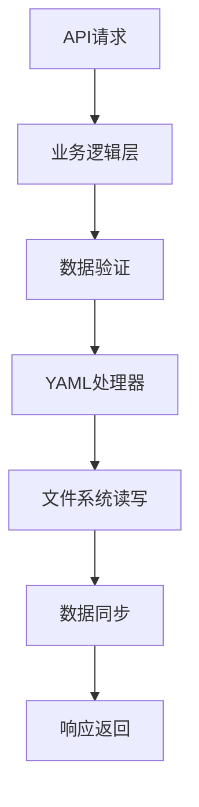
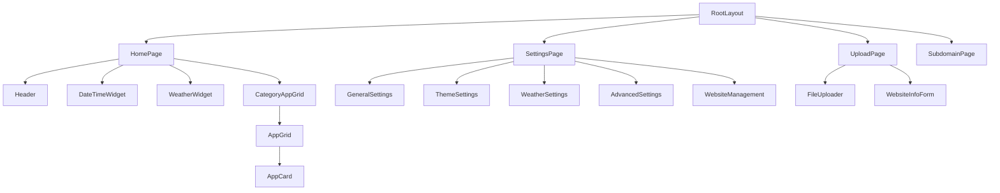

# 导航网站代码分析理解文档

## 项目概述

这是一个基于 Next.js 15 构建的个人HTML导航网站平台，名为"周千墨HTML导航页"。项目采用现代化的全栈架构，专注于提供简洁、高效的网站导航体验，支持HTML文件上传、子域名访问、配置管理等核心功能。

### 核心特性
- **HTML文件托管**: 支持上传HTML文件并通过子域名访问
- **应用导航**: 基于分类的应用展示和管理
- **配置管理**: 可自定义的主题、天气、布局等设置
- **密码保护**: 敏感操作需要密码验证
- **响应式设计**: 专注桌面端体验的现代化界面

## 技术架构

### 整体架构图



### 技术栈组成

| 技术分类 | 具体技术 | 版本 | 用途 |
|---------|---------|------|------|
| 前端框架 | Next.js | 15.4.3 | 全栈React框架 |
| UI库 | React | 19.1.0 | 用户界面构建 |
| 样式方案 | Tailwind CSS | 4.x | 原子化CSS框架 |
| 类型检查 | TypeScript | 5.x | 静态类型检查 |
| 图标库 | Lucide React | 0.525.0 | 现代图标组件 |
| 图标库 | Bootstrap Icons | 1.13.1 | 传统图标字体 |
| 数据解析 | js-yaml | 4.1.0 | YAML文件处理 |
| 工具库 | clsx, tailwind-merge | - | 样式类名处理 |

## 项目结构分析

### 目录组织架构

```
nav-web-site/
├── src/                          # 源代码目录
│   ├── app/                      # Next.js App Router
│   │   ├── api/                  # API 路由处理
│   │   │   ├── apps/             # 应用数据API
│   │   │   ├── config/           # 配置管理API  
│   │   │   ├── upload/           # 文件上传API
│   │   │   ├── auth/             # 认证验证API
│   │   │   └── analyze-html/     # HTML分析API
│   │   ├── settings/             # 设置页面
│   │   ├── upload/               # 文件上传页面
│   │   ├── subdomain/[subdomain] # 动态子域名路由
│   │   ├── layout.tsx            # 根布局组件
│   │   ├── page.tsx              # 首页组件
│   │   └── globals.css           # 全局样式
│   ├── components/               # React 组件库
│   │   ├── home/                 # 首页相关组件
│   │   ├── settings/             # 设置页面组件
│   │   ├── upload/               # 上传功能组件
│   │   ├── bookmark/             # 应用展示组件
│   │   └── ui/                   # 通用UI组件
│   ├── lib/                      # 工具函数库
│   │   ├── data/                 # 数据处理模块
│   │   ├── utils/                # 通用工具函数
│   │   ├── validation/           # 数据验证模块
│   │   └── auth.ts               # 认证工具
│   └── types/                    # TypeScript 类型定义
├── data/                         # 数据存储目录
│   ├── uploads/                  # HTML文件存储
│   ├── apps.yml                  # 应用数据
│   ├── config.yml                # 系统配置
│   └── bookmarks.yml             # 书签数据(保留)
└── middleware.ts                 # Next.js 中间件
```

## 核心功能模块

### 1. 应用导航系统

#### 数据模型设计
```typescript
interface App {
  id: string;                    // 唯一标识符
  name: string;                  // 应用名称
  url: string;                   // 访问链接
  icon?: string;                 // 图标名称(Bootstrap Icons)
  description?: string;          // 应用描述
  category?: string;             // 分类标签
  isHtmlFile?: boolean;          // 是否为HTML文件
  htmlFilePath?: string;         // HTML文件路径
  createdAt: Date;               // 创建时间
  updatedAt: Date;               // 更新时间
  private?: boolean;             // 是否私有
}
```

#### 分类展示架构


### 2. HTML文件上传系统

#### 上传流程设计


#### 文件处理机制
- **文件命名**: `{randomId}_{sanitizedName}.html`
- **路径存储**: `data/uploads/` 目录
- **安全策略**: 移除了HTML内容安全验证，允许任意HTML内容
- **访问方式**: 通过子域名路由系统访问

### 3. 子域名路由系统

#### 中间件处理逻辑
```typescript
// middleware.ts 核心逻辑
export function middleware(request: NextRequest) {
  const host = request.headers.get('host') || '';
  const subdomain = parseSubdomain(host);

  // 子域名重写到动态路由
  if (subdomain && subdomain !== 'www') {
    const url = request.nextUrl.clone();
    url.pathname = `/subdomain/${subdomain}`;
    return NextResponse.rewrite(url);
  }
  
  return NextResponse.next();
}
```

#### 动态路由解析


### 4. 配置管理系统

#### 配置数据结构
```typescript
interface SiteConfig {
  title: string;              // 网站标题
  description: string;        // 网站描述  
  theme: string;              // 主题名称
  showWeather: boolean;       // 显示天气
  location: string;           // 地理位置
  openAppNewTab: boolean;     // 新标签页打开
  showTitle: boolean;         // 显示标题
  greetings: string;          // 问候语
  showDateTime: boolean;      // 显示日期时间
  showApps: boolean;          // 显示应用
  hideSettingButton: boolean; // 隐藏设置按钮
  hideHelpButton: boolean;    // 隐藏帮助按钮
  enableEncryptedLink: boolean; // 加密链接
  iconMode: string;           // 图标模式
  keepLetterCase: boolean;    // 保持字母大小写
}
```

#### 设置页面模块
- **常规设置**: 网站标题、描述、问候语配置
- **主题设置**: 主题选择、图标模式配置
- **天气设置**: 地理位置、天气显示开关
- **高级设置**: 数据导入导出、系统配置
- **网站管理**: HTML网站的增删改查操作

### 5. 认证授权系统

#### 会话管理机制
```typescript
// 基于 sessionStorage 的临时认证
const SESSION_DURATION = 30 * 60 * 1000; // 30分钟

// 认证检查流程
function isAdminAuthenticated(): boolean {
  const isAuthenticated = sessionStorage.getItem('admin-authenticated');
  const authTime = sessionStorage.getItem('admin-auth-time');
  
  // 检查会话是否过期
  if (now - authTimestamp > SESSION_DURATION) {
    clearAdminSession();
    return false;
  }
  
  return isAuthenticated === 'true';
}
```

#### 密码验证流程


## 数据持久化架构

### YAML存储策略

#### 文件组织结构
- **apps.yml**: 应用数据存储
- **config.yml**: 系统配置存储  
- **bookmarks.yml**: 书签数据(保留但未使用)

#### 数据读写流程


#### 备份恢复机制
```typescript
// 自动备份功能
export async function backupData(): Promise<string> {
  const timestamp = new Date().toISOString().replace(/[:.]/g, '-');
  const backupDir = path.join(DATA_DIR, 'backups', timestamp);
  
  // 复制配置文件到备份目录
  await fs.mkdir(backupDir, { recursive: true });
  const files = [APPS_FILE, CONFIG_FILE];
  
  for (const file of files) {
    if (await fileExists(file)) {
      await fs.copyFile(file, path.join(backupDir, path.basename(file)));
    }
  }
  
  return backupDir;
}
```

## 用户界面架构

### 组件层次结构



### 样式系统设计

#### Tailwind CSS 配置
- **主题变量**: 使用 CSS 变量实现主题切换
- **响应式设计**: 专注桌面端体验，移动端适配
- **组件样式**: 原子化类名组合，避免样式冲突
- **动画效果**: 统一的过渡动画和阴影效果

#### 图标系统
- **Lucide React**: 现代化SVG图标，用于界面操作
- **Bootstrap Icons**: 传统图标字体，用于应用展示
- **图标选择器**: 可视化图标选择组件

## API设计架构

### RESTful API 设计

| 接口路径 | 方法 | 功能描述 |
|---------|------|---------|
| `/api/apps` | GET | 获取应用列表 |
| `/api/apps` | POST | 创建新应用 |
| `/api/apps` | PUT | 批量更新应用 |
| `/api/config` | GET | 获取系统配置 |
| `/api/config` | PUT | 更新系统配置 |
| `/api/upload` | POST | 上传HTML文件 |
| `/api/auth/verify-password` | POST | 验证管理密码 |
| `/api/analyze-html` | POST | 分析HTML内容 |

### 数据验证策略

#### 应用数据验证
```typescript
export function validateApp(data: any): ValidationResult {
  const errors: string[] = [];
  
  if (!data.name?.trim()) {
    errors.push('应用名称不能为空');
  }
  
  if (!data.url?.trim()) {
    errors.push('应用链接不能为空');
  }
  
  if (data.url && !isValidUrl(data.url)) {
    errors.push('应用链接格式不正确');
  }
  
  return {
    isValid: errors.length === 0,
    errors
  };
}
```

#### 文件上传验证
```typescript
export function validateFileUpload(file: File): ValidationResult {
  const errors: string[] = [];
  const maxSize = 10 * 1024 * 1024; // 10MB
  
  if (!file.type.includes('html') && !file.name.endsWith('.html')) {
    errors.push('只支持HTML文件');
  }
  
  if (file.size > maxSize) {
    errors.push('文件大小不能超过10MB');
  }
  
  return {
    isValid: errors.length === 0,
    errors
  };
}
```

## 性能优化策略

### 前端优化
- **组件懒加载**: 使用 React.Suspense 实现路由级懒加载
- **图片优化**: Next.js 自动图片优化和字体优化
- **代码分割**: Next.js 自动代码分割和预加载
- **缓存策略**: 静态资源缓存和API响应缓存

### 后端优化
- **文件缓存**: HTML文件读取缓存机制
- **数据缓存**: YAML文件内存缓存
- **请求优化**: 减少不必要的文件系统操作
- **并发处理**: 异步文件操作避免阻塞

## 安全机制

### 认证安全
- **会话管理**: 基于 sessionStorage 的临时认证
- **密码验证**: 后端API密码验证机制
- **会话超时**: 30分钟自动超时机制

### 文件安全
- **文件类型限制**: 仅允许HTML文件上传
- **文件大小限制**: 最大10MB文件大小
- **路径安全**: 文件名清理和路径规范化
- **访问控制**: 通过子域名控制文件访问

### 数据安全
- **输入验证**: 所有用户输入进行严格验证
- **XSS防护**: React自动XSS防护机制
- **文件系统安全**: 限制文件操作范围

## 扩展性考虑

### 数据库迁移
- 当前使用YAML文件存储，可轻松迁移到数据库
- 抽象的数据访问层便于后续数据库集成
- 完整的类型定义支持ORM集成

### 功能扩展
- 模块化组件设计便于功能扩展
- 插件化架构支持第三方扩展
- 配置驱动的功能开关机制

### 部署扩展
- 容器化部署支持
- 静态资源CDN部署
- 多实例负载均衡支持

## 开发和运维

### 开发环境
```bash
# 安装依赖
npm install

# 启动开发服务器
npm run dev

# 构建生产版本
npm run build

# 启动生产服务器
npm start
```

### 文件结构约定
- **组件命名**: PascalCase 组件名
- **文件组织**: 功能模块分组
- **类型定义**: 集中式类型管理
- **工具函数**: 按功能分类组织